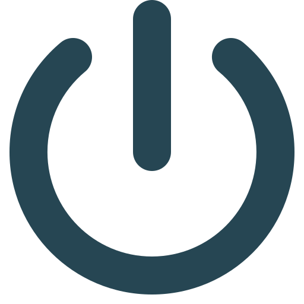

# Selbsthilfegruppe *jung und gestört* Mannheim

Wir sind eine Gruppe psychisch Erkrankter im Raum Mannheim. Unsere Mitglieder sind im Alter von ca. 25-40 Jahren und haben alle eine Erkrankung aus dem Bereich der affektiven Störungen (Depression, Borderline, etc.). Wir nehmen uns selbst nicht zu ernst - wir treten unserer Krankheit mit einem Lächeln entgegen, denn anders ist es manchmal auch nicht zu ertragen. Wir versuchen aktiv unser Wohlbefinden zu verbessern und ermutigen uns gegenseitig positive Veränderungen in unseren Leben anzustoßen. Hierbei haben wir die Erfahrung gemacht, dass der Austausch mit anderen Betroffenen sehr hilfreich sein kann, da für Personen ohne psychische Erkrankung erlebte Sorgen, Probleme und Gefühlszustände teils nur schwer nachzuvollziehen sind.

Wir tauschen uns zu folgenden Themen aus:

<ul>
  <li class="enum-with-icons">Symptome psychischer Erkrankungen, aktuelle Themen wie Erfolgserlebnisse und Probleme</li>
  <li class="enum-with-icons">Medikamente und nicht-medikamentöse Therapien </li>
  <li class="enum-with-icons">Ambulante Psychotherapie</li>
  <li class="enum-with-icons">Sozialgesetzliche Aspekte (Anlaufstellen, berufliche Wiedereingliederung, Schwerbehindertenausweis, etc.)</li>
  <li class="enum-with-icons">Stationäre Aufenthalte im Zentralinstitut für seelische Gesundheit in Mannheim</li>
</ul>

## Unsere Treffen
Wir treffen uns alle zwei Wochen im [Gesundheitstreffpunkt Mannheim](https://www.gesundheitstreffpunkt-mannheim.de) in Neckarstadt-Ost:

<ul>
  <li class="enum-with-icons">
    
     Max-Joseph-Str. 1   68167 Mannheim
  </li>
</ul>
Bei unseren Treffen geht es hauptsächlich darum, eine gute Zeit miteinander zu verbringen und Spaß zu haben - das Leben ist schon ernst genug. Zu unseren Aktivitäten gehören:
<ul>
  <li class="enum-with-icons">Gesellschaftsspiele (Activity, Kniffel, etc.)</li>
  <li class="enum-with-icons">Gemeinsame Café- und Restaurantbesuche</li>
  <li class="enum-with-icons">Gemeinsamer Besuch von Veranstaltungen</li>
</ul>

## Gruppenregeln

> "Depressive halten sich an Absprachen" 

Wir geben aufeinander Acht und melden uns gegenseitig den Eindruck des anderen zurück, denn häufig sind Depressive nur schwer selbst in der Lage, ihre eigene Situation realistisch einzuschätzen. **Wichtig: Jedes Gruppenmitglied trägt für sich selbst Verantwortung! Die Selbsthilfegruppe versteht sich als Ergänzung zu psychiatrischer und psychotherapeutischer Behandlung. Keinesfalls kann die Selbsthilfegruppe professionelle Behandlung ersetzen!**

1. **Freiwilligkeit**: Die Teilnahme an der Gruppe ist freiwillig. Jede Person kann ausscheiden, wann sie es für richtig hält.
2. **Selbstbetroffenheit**: Alle Mitglieder sind von der gleichen oder ähnlichen Situation betroffen.
3. **Selbstverantwortung**: Jedes Mitglied vertritt sich selbst und ist selbst dafür zuständig, wie stark es sich ins Gespräch einbringt.
4. **Verschwiegenheit**: Was in der Gruppe besprochen wird, wird nicht an Außenstehende weitergegeben.
5. **Zuverlässigkeit**: Die Treffen beginnen und enden zur vereinbarten Zeit: Wer nicht kommen kann, meldet sich bei der Gruppe oder einem Mitglied ab.
6. Es redet immer nur eine Person
7. Jede(r) hat das Recht auf eine eigene Meinung. Ansichten und Gefühle werden nicht bewertet.
8. **Suizidalität** ist ein mögliches Symptom einer Depression, wird aber in der Selbsthilfegruppe grundsätzlich nicht besprochen, da dies für andere Gruppenmitglieder sehr belastend sein kann. Psychiater und Psychotherapeuten können dieses Thema professionell mit Betroffenen besprechen. 
9. **Die Gruppe entscheidet**: Wichtige Entscheidungen, die die ganze Gruppe betreffen, werden gemeinsam in einem transparenten Prozess erarbeitet und getragen.

## Interesse geweckt?
Du hast eine psychische Erkrankung und würdest uns gerne kennen lernen? Dann freuen wir uns über eine E-Mail von dir an [{{ site.email }}](mailto:{{ site.email }}). Schreib uns einfach kurz wer du bist, wie du auf uns aufmerksam geworden bist und wie wir dich erreichen können. Wir melden uns dann zeitnah mit ein paar Infos bei dir.

Du bist nicht gut drauf? Klick auf den Button für ein bisschen Freude:

    

<script src="assets/js/confetti.js">
